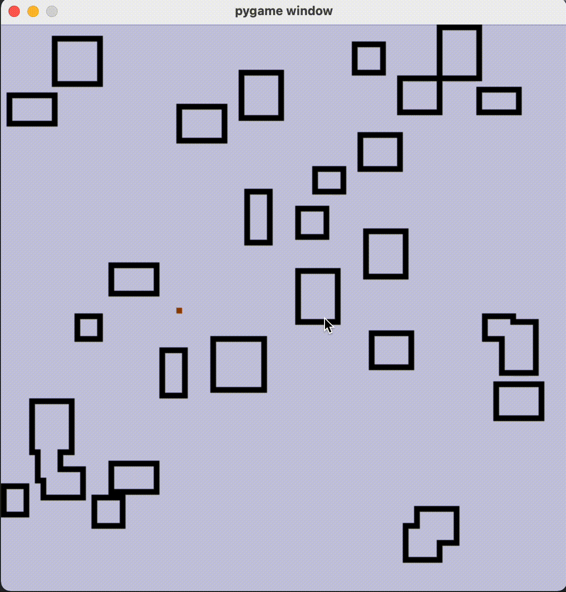

# Wayfinding

Welcome to wayfinding at Astro Robotics!

- simulator.py is a simulator that creates obstacles and allows you to test a rover algorithm specified in rover.py

## Current progress
- Basics work

    - The blue points are the points that the rover knows about  

## Issues
- Gets stuck in corners really often

## Goals
The rover must go from point A to B, along rough terrain. The rovers/teams ability to pick the best path, and handle obstacles is important.

## Prerequisites 
- Writing code for non-autonomous motors control
    - Functions for driving forward, turning, etc. 
- Interfacing with game controller:
    - Mapping the buttons to different tasks, maybe have different control profiles.
- Outputting various robot data on an LCD screen:
    - Sensor data, robot state data.
        - Battery life
        - GPS location
        - States of all the motors
        - Readings of all the sensors
    - Have some sort of UI for selecting what sort of data you want to display.
        - Buttons? Dials?

## Wayfinding consists of
- Obstacle detection with ultrasonic sensor.
- Creating a live map of obstacles and planning a route around them. <-- pure CS, no roadblocks
    - http://www.cs.columbia.edu/~allen/F17/NOTES/lozanogrown.pdf
- Giving motor control instructions based on the planned route.

## Unknowns 
- Need more information about the rover:
    - What motors will be used?
    - What will be the sizes of the wheels?
    - Will it be powered by an Arduino AND a Raspberry Pi?
